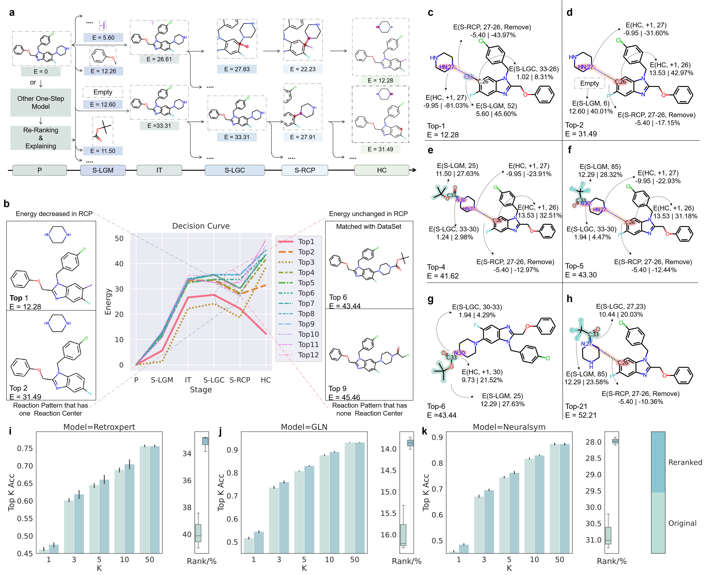

# RetroExplainer
[](https://zenodo.org/badge/latestdoi/543984477)
# Overview

RetroExplainer: A chemical knowledge guided deep-learning framework for retrosynthesis prediction with molecular assembly reasoning and quantitative interpretability


# Installation

**Download the repository**

```shell
git clone git@github.com:wangyu-sd/RetroExplainer
cd RetroExplainer
```

**Install required packages**

We recommend to use anaconda to get the dependencies. If you don't already have anaconda, install it by following instructions at this link: https://docs.anaconda.com/anaconda/install/.

Then, open the terminal on Linux and enter the  following commands to create a new conda environment and install the  required packages:

```sh
conda create -n mechretro --file requirement.txt
conda activate mechretro
```

If the previous commands don't work, you can install the packages separately:

1. Create a new virtual environment with a 3.7.13 version of python:

   ```sh
   conda create -n RetroExplainer python=3.7.13
   conda activate RetroExplainer
   ```

2. Install `pytroch` with correct CUDA version. To find your suitable version, see https://pytorch.org/get-started/locally/

   ```shell
   conda install pytorch torchvision torchaudio pytorch-cuda=11.6 -c pytorch -c nvidia
   ```

3. Install `pytorch-lightning`:

   ```shell
   conda install pytorch-lightning -c conda-forge
   ```

4. Install `torch-geometric` and its corresponding dependencies, see https://pytorch-geometric.readthedocs.io/en/latest/notes/installation.html.

   ```shell
   conda install pyg -c pyg
   ```

5. Install rdkit:

   ```shell
    conda install -c conda-forge rdkit
   ```

Other packages can be easily installed by calling `pip install xxx` command.

# Model Training

The `USPTO-50K`  datasets can be download [here](https://drive.google.com/file/d/12WnLFJ6LSVj6Z47ZTREEpMXAOKTNAjJe/view?usp=share_link) , and should be put under the folders `/data` .

You can run the training stages by following command for reaction type known conditions:

```shell
sh scripts/train_for_uspto50k.sh
```

And for reaction type unknown:

```shell
sh scripts/train_for_uspto50k_rxn_type_unknown.sh
```

As for additional datasets, e.g.,   `USPTO-50K` using t-split method, `USPTO-FULL`, `USPTO-MIT` , and your customized datasets own datasets, you can put them in the directory `data/your_datasets/raw` , and set the argument to `data/your_datasets ` .

The above mentioned dataset also can be obtained in the following entries:

+ `USPTO-50K` (random split): https://github.com/Hanjun-Dai/GLN ,
+ `USPTO-50K` (Using t-split method): https://drive.google.com/file/d/1_cko4Wym0W_UaRp74KvbEJCrfQBfrVKQ/view?usp=sharing
+ `USPTO-MIT` : https://github.com/wengong-jin/nips17-rexgen/blob/master/USPTO/data.zip,
+ `USPTO-FULL`: https://github.com/Hanjun-Dai/GLN.

# Re-ranking

The data correspond to re-ranking experiments can be found in https://drive.google.com/file/d/1SMK1P2IXcWh0T2KHxresxu6_dKkgA7jd/view?usp=sharing.

# Reproduce results

## Model performance

At first, you can download the checkpoints [here](https://drive.google.com/file/d/1GgYO8SjKonlkUKhsthp2R8wo2onc0SMI/view?usp=sharing) for reaction-type-known model (`USPTO-50K`) and [here](https://drive.google.com/file/d/1Z5IzsCEOgO-_rgLBa0VZZvMyV36-eIOG/view?usp=sharing) for unknown model. Or you can train your own model according to the section **Model Training** . 

Then, put the checkpoints under the `model_saved` folder, and run the following command:

```shell
sh scripts/test_for_uspto50k.sh
```

Similarly, for reaction type unknown conditions, you can:

```shell
sh scripts/test_for_uspto50k_rxn_type_unknown.sh
```

Other check points can be found in the following URLs and the reproduction can be easily run upon modifying the corresponding commands of the scripts.

+ `USPTO-50K` (Using t-split method): https://drive.google.com/file/d/1_cko4Wym0W_UaRp74HJHUSrVKQ/view?usp=drive_link
+ `USPTO-MIT` : https://drive.google.com/file/d/1lSy1zbrzMgQypEft5f9_4s3nvWbL5mx7/view?usp=sharing
+ `USPTO-FULL`: https://drive.google.com/file/d/1iV40xTstPHSRCzNiYLXX_zird1I1Q6tN/view?usp=sharing 

## Re-ranking ability

Checkpoint of re-ranking model can be downloaded here: https://drive.google.com/file/d/1a7loRClJtF2t8Vd-4wN_-2HqM_wCvI18/view?usp=sharing.

The results can be reproduced through the following commands:

```shell
python reranking_and_explaining.py \
  --batch_size 64 \
  --cuda 2 \
  --dataset GLN_200topk_200maxk_noGT_77777777_test
```


# Interpretability

We introduced an energy-based molecular assembly process that offers transparent decision-making and interpretable retrosynthesis predictions. This process can generate an energy decision curve that breaks down predictions into multiple stages and allows substructure-level attributions; the former can help understand the "counterfactual" predictions to discover potential biases in the dataset, and the latter can provide more granular references (such as the confidence of a certain chemical bond being broken) to inspire researchers to design customized reactants.



**Generated explanations through molecular assembly process decision process. a.** The decision process of two predictions, including reactions with and without leaving groups. **b.** The decision curve of top-12 predictions by RetroExplainer. The same reaction patterns have the same energy change. **c-h**. Nine representative instances for substructure attributions, which allows a granular insight. **i-k**. Performance on re-ranking results compared with three effective retrosynthesis models.


# Interpretable Multi-Step Planing

For multi-step predictions, you can click [here](https://drive.google.com/file/d/1HxDJKe5WyHFet-YOmWP3EpOwT_uAR3yr/view?usp=share_link) to get purchasable molecule set, and put it under the folder `/data/multi-step/retro_data/dataset/`. 

We provide a more robust checkpoint trained on larger scale datasets, which takes about a week on three 3090 GPUs.  You can download the checkpoint [here](https://drive.google.com/file/d/14v4UGZmt9WkWE3h7bZOilglxa99UTCha/view?usp=sharing). And don't forget put it under the folder `model_saved`. Note that this version need a larger vocabulary of leaving groups, you can click [here](https://drive.google.com/file/d/1Cr5yfr4h3knewwGUnZB02TLRbGTd3nFC/view?usp=share_link) to get the vocabulary. And put the `leaving_group.pt` under the folder `data/multi-step/`.

You can get the reasoning process and their energy scores by modifying ` smi_list` in  `api_for_multisetp.py`:

```python
if __name__ == '__main__':
    planner = RSPlanner(
        gpu=-1,
        use_value_fn=False,
        iterations=500,
        expansion_topk=10,
        viz=True,
        viz_dir='data/multi-step/viz'
    )
    smi_list = [
        "CC(CC1=CC=C2OCOC2=C1)NCC(O)C1=CC=C(O)C(O)=C1"
    ]
    for smi in smi_list:
        result = planner.plan(smi, need_action=True)
        print(result)
```

Then you can get following retrosynthetic routes:

```
{'succ': True, 'time': 48.523579359054565, 'iter': 18, 'routes': "CC(CC1=CC=C2OCOC2=C1)NCC(O)C1=CC=C(O)C(O)=C1>3.2358>NCC(O)c1ccc(O)c(O)c1.CC(=O)Cc1ccc2c(c1)OCO2|NCC(O)c1ccc(O)c(O)c1>7.8090>NC(=O)C(O)c1ccc(O)c(O)c1|CC(=O)Cc1ccc2c(c1)OCO2>10.1133>CC(O)Cc1ccc2c(c1)OCO2|NC(=O)C(O)c1ccc(O)c(O)c1>9.0024>N.O=C(O)C(O)c1ccc(O)c(O)c1[['Select Leaving Group with Index 6 and Cost 0.43', 'Initial Cost:10.37', 'Add Bonds: between 1 and 24 with Bond Type 2.0 and Cost -6.05', 'Remove Bonds: between 1 and 12, with Bond Type 1.0 and Cost -1.35', 'H number change -1 cost of atom 2: 0.18', 'H number change 1 cost of atom 13: 0.09'], ['Select Leaving Group with Index 6 and Cost 3.49', 'Initial Cost:7.66', 'Add Bonds: between 1 and 12 with Bond Type 2.0 and Cost -1.01', 'H number change -2 cost of atom 2: 1.16'], ['Select Leaving Group with Index 20 and Cost 2.84', 'Initial Cost:7.17', 'Replace Bonds: between 1 and 2, from Bond Type 2.0 to Bond Type1 with Cost -0.52', 'H number change 1 cost of atom 2: 2.22', 'H number change 1 cost of atom 3: 1.24'], ['Select Leaving Group with Index 3 and Cost 2.58', 'Initial Cost:11.32', 'Add Bonds: between 1 and 13 with Bond Type 1.0 and Cost -2.01', 'Remove Bonds: between 0 and 1, with Bond Type 1.0 and Cost -1.42', 'H number change 1 cost of atom 1: 1.12'], None, None, None]", 'route_cost': 30.16051983833313, 'route_len': 4} 
```
